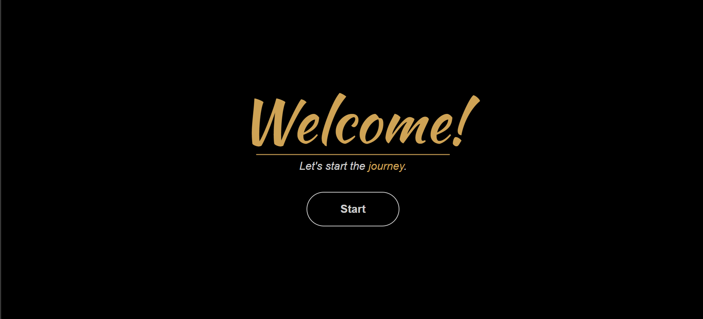
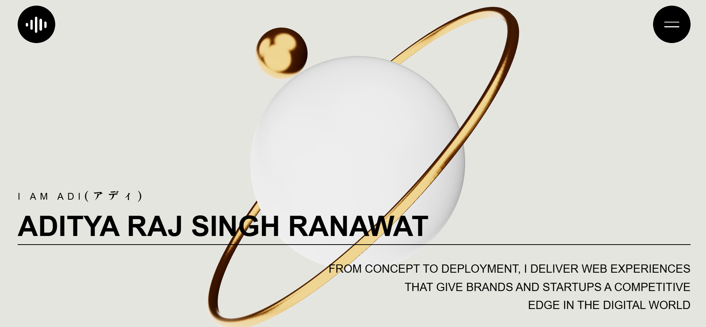
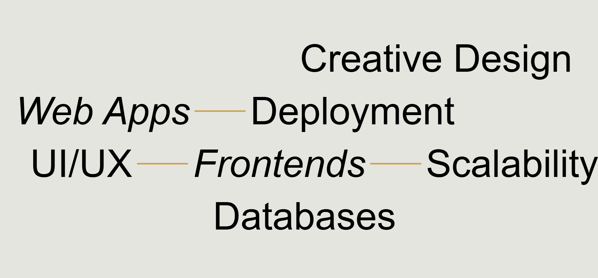
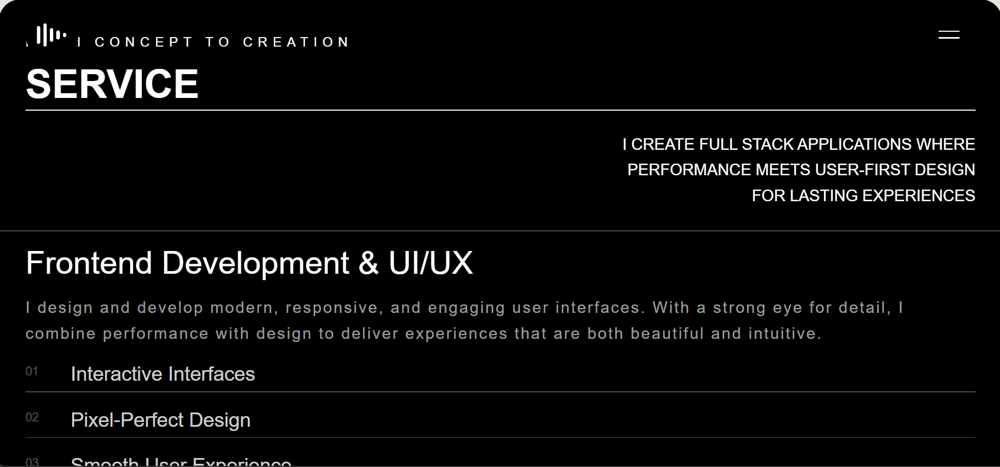
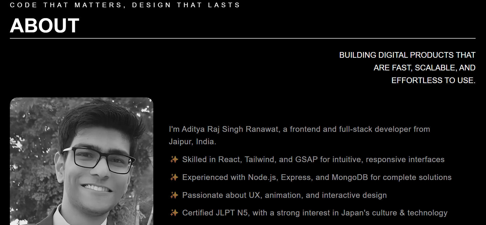
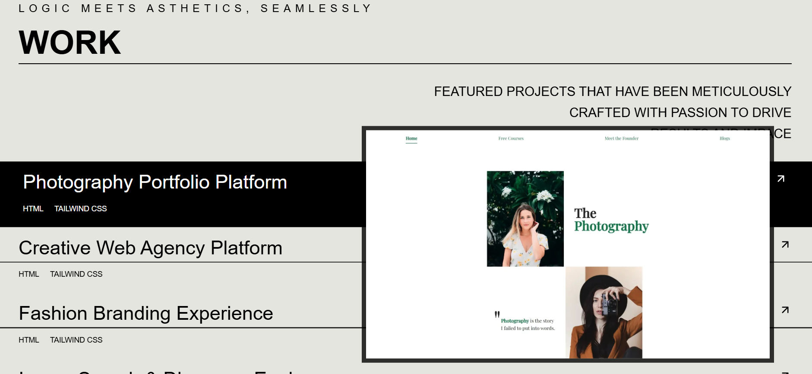
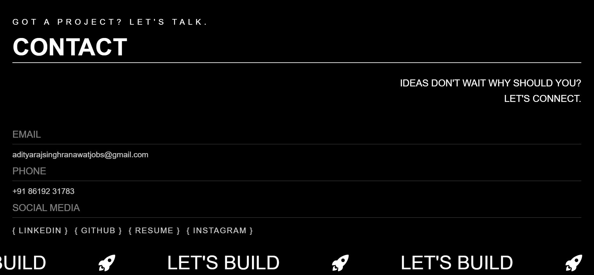

# 🌐 Portfolio Website

A modern, responsive, and interactive **portfolio website** built to showcase my work, skills, and projects. The site is designed with performance, animations, and user experience in mind.

## ✨ Features

- 🎨 **Clean & Modern UI** – Responsive design for desktop, tablet, and mobile.
- 🌀 **Smooth Animations** – GSAP-powered scroll and section transitions.
- 🖼️ **3D Integration** – React Three Fiber for interactive 3D experiences.
- ⚡ **Performance Optimized** – Compressed models, lazy loading, DPR scaling, and FPS tuning.
- 🔍 **SEO Ready** – Meta tags, preview image, and accessibility improvements.
- 📱 **Mobile-First Design** – Tested and optimized for real-world mobile usage.

## 🛠️ Tech Stack

- **Framework**: React
- **Styling**: TailwindCSS
- **Animations**: GSAP
- **3D Rendering**: React Three Fiber, Drei
- **Optimizations**: Suspenser, Invalidate, FPS analyzer, DPR adjustments
- **Utilities**: Lenis (smooth scroll), Iconify

## 🚀 Development Highlights

- Refactored multiple times for improved layout and responsiveness.
- Integrated and debugged Lenis smooth scrolling.
- Optimized 3D performance by tuning camera, frame rates, and pixel ratios.
- Designed and animated sections: **Hero, About, Services, Contact**.
- Converted assets to WebP for faster loading.
- Conducted real-user testing and refined based on feedback.
- Finalized animations and design consistency before moving to the maintenance phase.

## 🌍 Live Demo

👉 [Visit the Live Site](https://aditya-creative-dev-portfolio.netlify.app/)

## 📷 Preview

## 👨‍💻 Author

**Aditya Raj Singh Ranawat**
Passionate Web Developer exploring **3D web, GSAP animations, and user centric driven experiences**.

📍 Jaipur, India | JLPT N5 Certified
